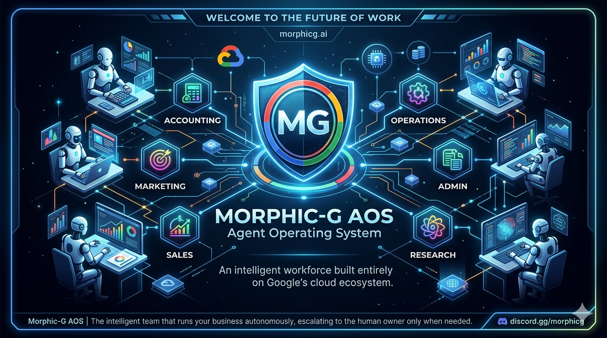
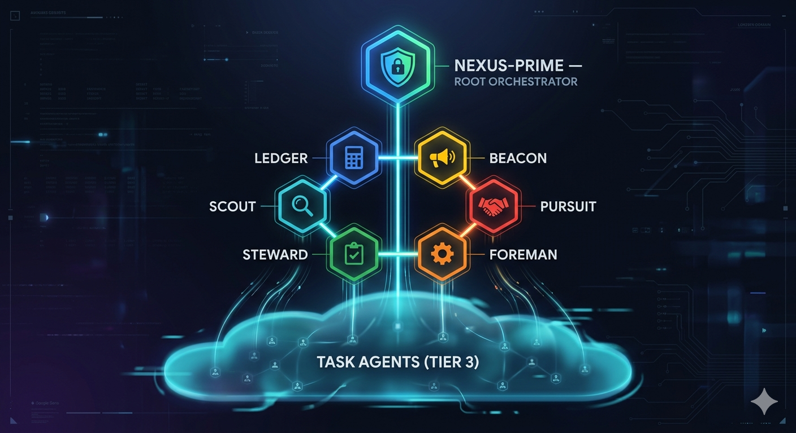
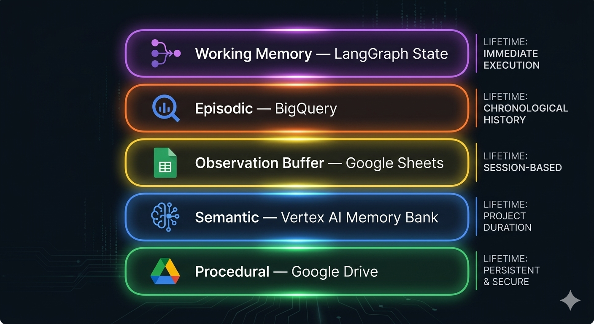
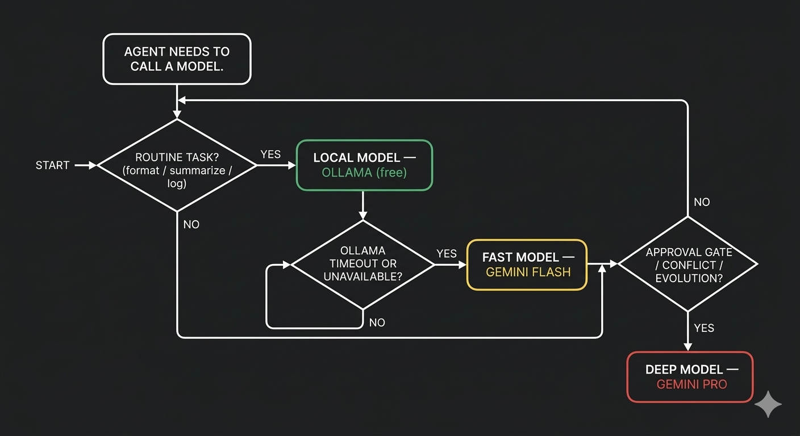
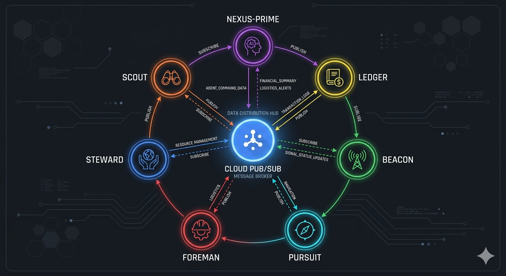
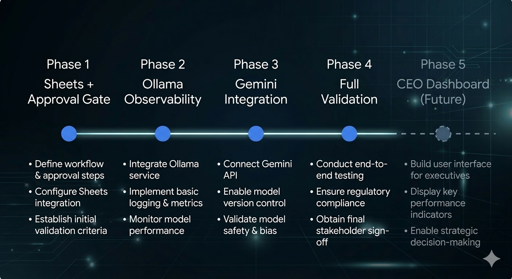
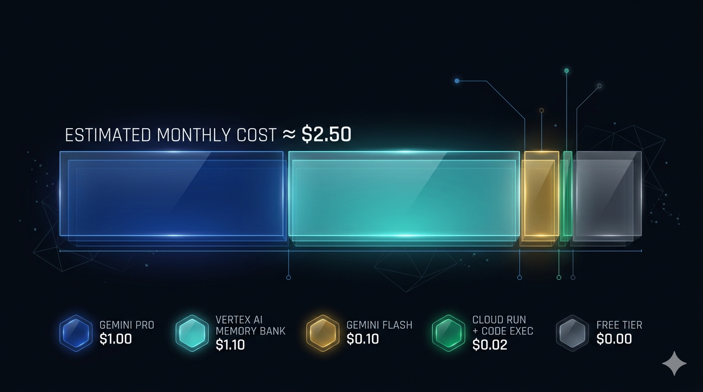

<div align="center">

<!-- Banner: save the project graphic as Docs/assets/morphicg-banner.png and uncomment the line below -->


# Morphic-G AOS
### The Intelligent Workforce for Small Business

**A self-evolving team of AI agents** that runs your accounting, marketing, sales, operations, admin, and research — autonomously — on Google's cloud ecosystem, for roughly **$5/month**.

[](#documentation)
[](#setup)
[](#hybrid-llm-strategy)
[](#)

### 📋 [New here? Start with the Project Summary →](Docs/Morphic-GAOS-Manager-Summary.md)

</div>

---

## The Problem

Running a small business means context-switching between a dozen domains — invoices, ad campaigns, leads, inventory, HR, and research — all day, every day. Existing AI tools help with one task at a time. They don't remember what happened last week, they can't coordinate across departments, and they always send everything back to you.

**Morphic-G AOS is different.** It is not a chatbot. It is a coordinated team of specialized agents that handle the routine work, communicate with each other, learn from patterns over time, and surface decisions to the human owner *only when a human is genuinely needed.*

---

## How It Works

Think of it like a well-run office:

- **Nexus-Prime** is the general manager — it watches the whole business, routes work to the right department, and is the only entity authorized to deploy changes to the system.
- **Six domain orchestrators** (Ledger, Beacon, Pursuit, Foreman, Steward, Scout) are the department heads. Each owns a slice of the business and reports status to a shared Google Sheet.
- **Task agents** (Tier 3) are the specialists — they do one job (parse an invoice, score a lead, check a shipment) and hand the result back to their orchestrator.
- **You** interact through a Google Sheet. When an agent needs a real decision — committing a payment, deploying new code, sending an outbound email — it writes a proposal to the `Agent_Approvals` tab and waits. You click **Approved** or **Rejected** and the agent picks up where it left off.

No terminal. No logs to read. No dashboards to build.

<div align="center">

</div>

---

## Agent Modules

| Agent | Domain | What it handles |
|-------|--------|----------------|
| **Ledger** | Accounting | Invoice matching, bank reconciliation, P&L tracking, accounts payable |
| **Beacon** | Marketing | Campaign performance, ad spend optimization, lead generation, website metrics |
| **Pursuit** | Sales | CRM pipeline, lead scoring, quote generation, deal-to-close tracking |
| **Foreman** | Operations | Inventory management, vendor SLAs, shipping & receiving, order fulfillment |
| **Steward** | Admin | Compliance, onboarding, document filing, HR-adjacent tasks |
| **Scout** | Research | Competitive intelligence, market analysis, product research, pricing data |
| **Nexus-Prime** | System | Orchestration, approvals, conflict resolution, self-evolution oversight |

### Cross-Domain Workflows

Agents collaborate across departments through defined policies. Examples:

- **Lead-to-Revenue:** Beacon qualifies a lead → Pursuit closes it → Ledger invoices → Foreman ships.
- **Purchase Reconciliation:** Foreman receives goods → Ledger matches the vendor invoice.
- **Market-to-Campaign:** Scout surfaces a competitor move → Beacon adjusts ad strategy.

#### Reactive Event-Driven Workflows (Phase 3)

Two new routing nodes in Nexus-Prime turn domain events into automatic cross-agent work orders — no manual trigger required:

- **Market Watchdog** — When Foreman emits `STOCK_INSUFFICIENT`, Nexus-Prime immediately dispatches an urgent sourcing-research task to Scout (`alert_type: stock_insufficient`). Scout front-queues the SKU ahead of all routine research and begins finding alternative suppliers.
- **ROI Optimizer** — When Pursuit emits `DEAL_CLOSED`, Nexus-Prime evaluates the gross margin. If it falls below **20 %**, Nexus-Prime dispatches a `low_margin` alert to Beacon. Beacon front-queues a lead-source ROI analysis to determine whether the marketing channel is generating unprofitable leads.

These workflows are implemented entirely in Nexus-Prime's event dispatcher (`market_watchdog` and `roi_optimizer` nodes) and the receiving agents' `_plan()` monitors. No new microservices, no polling — the Pub/Sub message is the trigger.

---

## Key Capabilities

### Self-Evolution (Human-Gated)
When an agent encounters a task it has no tool for, it writes and tests a Python solution (max 5 iterations, 15 min, $0.50 cost cap), then submits the code for human approval. The code is **SHA-256 pinned at submission** and passes a two-gate static analysis before it ever reaches the Approval Queue:

1. **Pattern gate** — blocks `os.system`, `subprocess.*`, `pickle.loads`, `eval`, `exec`, and similar dangerous call patterns by walking the AST.
2. **Import gate** — validates every `import` and `from … import` against an explicit allowlist using **exact module-boundary matching** (e.g. `import requests` is blocked even though `re` is allowlisted — a substring match would pass it through). Only `stdlib`, `google.*`, `gspread`, `pydantic`, `langgraph`, `config`, `models`, `tools`, and `agents` are permitted.

No agent can deploy its own code unilaterally. Code that fails either gate never reaches the Approval Queue — the evolution loop is hard-stopped and the result logged.

### Layered Memory
| Layer | Where | Lifetime |
|-------|-------|---------|
| Working memory | LangGraph state | One task |
| Episodic memory | BigQuery | 7–30 days |
| Observation buffer | Google Sheets | 14 days |
| Semantic memory | Vertex AI Memory Bank | Indefinite, versioned |
| Procedural knowledge | Google Drive (Markdown) | Version-controlled |
| Procedural retrieval | Vertex AI Search | Read-only index over Layer 5 |

<div align="center">

</div>

### Infrastructure Resilience (Phase 4 / Ch. 8)

Three patterns from the [OpenClaw Paradigm](https://github.com/chunhualiao/openclaw-paradigm-book) are now wired into production:

- **Circuit Breaker** (`tools/circuit_breaker.py`) — CLOSED → OPEN → HALF_OPEN state machine keyed by `(agent_id, resource_key)`. Prevents nexus-prime from hammering dead Google Sheets or BigQuery endpoints. Wired around `append_row("Agent_Approvals")` and `insert_row("aos_logs.task_outcomes")` — the two highest-blast-radius write paths.
- **Phoenix Recovery** (`tools/phoenix.py`) — SHA-256-pinned working-state snapshots written to `aos_logs.agent_checkpoints` (BigQuery, 30-day TTL). After every successful task write, nexus-prime checkpoints its full `NexusPrimeWorkingMemory`. On restart, `phoenix_recover()` validates the state and restores from the last vetted snapshot if corruption is detected. Tampered checkpoint rows are silently skipped.
- **AgentState FSM + output coherence** (`agents/__init__.py`) — The OODA loop is now a typed enum (`INIT → PLANNING → EXECUTION → OBSERVATION → …`). `log_state_transition()` emits structured Cloud Logging entries at every node boundary. `validate_output_coherence()` runs an offline LOCAL_MODEL sanity check on agent outputs — degrades gracefully when Ollama is unavailable.

### Hybrid LLM Strategy
| Tier | Model | Used for |
|------|-------|---------|
| `LOCAL_MODEL` | Ollama / llama3 (free, local) | Formatting, summarizing, routine logging |
| `FAST_MODEL` | Gemini 2.5 Flash (GCP, billed per token) | Moderate reasoning, routing, lookups |
| `DEEP_MODEL` | Gemini 2.5 Pro (GCP, billed per token) | Approval gate proposals, conflict arbitration, code evolution |

All model references in code are aliases from `settings.yaml`. To upgrade to a new Gemini release, update one line in that file — no code changes needed.

<div align="center">

</div>

### Event-Driven Approval Queue
Proposals to the `Agent_Approvals` Sheet tab trigger a Pub/Sub event the instant the owner changes the status cell. No polling, no lost messages on restart, no blocking the agent's work queue while it waits.

The gate uses two distinct message types:
- **`APPROVAL_REQUEST`** — agent → Nexus-Prime: *"I need a human decision on this."*
- **`APPROVAL_RESULT`** — Apps Script → Nexus-Prime (via Pub/Sub): *"The owner clicked Approved/Rejected."*

Proposals that go unanswered are handled by a Cloud Scheduler job that fires an **`TTL_SWEEP`** message to Nexus-Prime once per hour. Nexus-Prime re-notifies the owner and auto-rejects proposals that have exceeded 2× their priority deadline — so the queue never silently fills with stale requests.

<div align="center">

</div>

### Multi-Project Support
A single deployment can manage multiple business units or client accounts. Each project gets its own Sheet workbook, Drive folder, and topic namespace. Data never crosses project boundaries.

---

## Architecture

```
┌─────────────────────────────────────────────────────────────────┐
│                    Human Owner                                  │
│              Google Sheet (Approval Queue)                      │
└──────────────────────────┬──────────────────────────────────────┘
                           │ onChange trigger (Apps Script)
                           ▼
┌─────────────────────────────────────────────────────────────────┐
│                    Nexus-Prime (Tier 1)                         │
│          Approval Gate · Conflict Resolution · Evolution        │
└──────┬──────────┬──────────┬──────────┬──────────┬─────────────┘
       │          │          │          │          │
  Cloud Pub/Sub (A2AMessage envelope — all communication)
       │          │          │          │          │
  ┌────▼──┐  ┌───▼───┐  ┌───▼──┐  ┌───▼────┐  ┌──▼────┐  ┌──────┐
  │Ledger │  │Beacon │  │Pursuit│  │Foreman │  │Steward│  │Scout │
  │(Acct) │  │(Mktg) │  │(Sales)│  │(Ops)  │  │(Admin)│  │(Res) │
  └───────┘  └───────┘  └───────┘  └────────┘  └───────┘  └──────┘
       │                                │
  Google Sheets · BigQuery · Vertex AI Memory Bank · Google Drive
```

**Entry point:** A single `main.py` (FastAPI) is deployed to all 7 Cloud Run services. The `AGENT_NAME` environment variable selects which orchestrator handles requests. Services run with `workers=1` — LangGraph state is never shared across processes. Endpoints: `GET /health` · `POST /pubsub` · `POST /ttl-sweep` · `POST /sync` · `POST /archive` · `POST /daily-sync` · `POST /sheets-sync` · `POST /chat` · `POST /vision` · `POST /poll-comments` · `POST /infra-provision` · `POST /gmail-webhook` · `POST /daily-digest` · `POST /gmail-renew-watch`. All POST endpoints are deployed `--no-allow-unauthenticated`; OIDC token verification is defense-in-depth.

**Infrastructure:** Cloud Run (scale-to-zero) · Cloud Pub/Sub · Secret Manager · BigQuery · Vertex AI · Cloud Scheduler · Google Apps Script

### External APIs & Services

| Category | API / Service | Tool module | Purpose |
|----------|--------------|-------------|---------|
| **AI / LLM** | Gemini AI (`google-genai`) | `agents/__init__.py` | LLM inference — FAST_MODEL, DEEP_MODEL |
| **AI / LLM** | Ollama (local HTTP via loca.lt tunnel) | `agents/__init__.py` | LLM inference — LOCAL_MODEL |
| **AI / LLM** | Vertex AI Memory Bank | `tools/memory.py` | Semantic memory (RAG corpora) |
| **AI / LLM** | Vertex AI Search | `tools/vertex_search.py` | Knowledge base search over Drive |
| **AI / LLM** | Vertex AI RAG (`vertexai.rag`) | `scripts/_create_corpora.py` | Corpus provisioning |
| **Google Cloud** | Cloud Pub/Sub | `tools/pubsub.py` | Agent-to-agent messaging |
| **Google Cloud** | BigQuery | `tools/bigquery.py`, `tools/memory.py` | Task outcomes, audit logs, episodic memory |
| **Google Cloud** | Secret Manager | `tools/secrets.py` | All credentials at runtime |
| **Google Cloud** | Cloud Run | `main.py` (host) | Serves all 7 agents as HTTP services |
| **Google Cloud** | Cloud Scheduler | `tools/infra_provision.py` | Scheduled job triggers |
| **Google Cloud** | Cloud Logging | `agents/__init__.py` | Structured runtime logs |
| **Google Workspace** | Gmail API | `tools/gmail.py` | Read inbox, send replies, push watch |
| **Google Workspace** | Google Sheets (`gspread`) | `tools/google_sheets.py` | Approval Gate, task state, logs |
| **Google Workspace** | Google Drive | `tools/drive.py` | File organization, Knowledge base |
| **Google Workspace** | Google Docs | `tools/google_docs.py` | Blueprint creation, comment polling |
| **Google Workspace** | Google Chat | `tools/google_chat.py` | Approval cards (currently deprecated) |
| **Google Workspace** | Google Custom Search | `tools/google_search.py` | Structured web research for Scout |
| **Google Workspace** | Apps Script (webhook) | `apps_script/` | Sheet-side approval trigger → Pub/Sub |
| **Other** | Google ADK (`google.adk`) | `agents/` | Agent framework / LangGraph orchestration |
| **Other** | Outbound webhook (HMAC-signed HTTP) | `tools/webhook_sender.py` | External notifications |
| **Other** | Web search | `tools/web_search.py` | Open web research |
| **Other** | Grafana | `dashboard/grafana/` | Observability dashboard (Cloud Run) |

<div align="center">

</div>

---

## Setup

> Full step-by-step instructions are in [`Docs/GAOS-Deploy-Spec.md`](Docs/GAOS-Deploy-Spec.md). This is a summary.

### Prerequisites

- Google account with GCP billing enabled
- `gcloud` CLI, `uv`, `git`, `gh`, and `ollama` installed locally
- Python 3.11+

### 1. Clone and install dependencies

```powershell
git clone https://github.com/EgoNoBueno/Morphic-GAOS-Manager.git
cd Morphic-GAOS-Manager
uv venv    # create .venv/
uv sync    # install all dependencies from pyproject.toml
```

> **SDK note:** Use `google-genai>=1.0.0` — not `google-generativeai`. The older package is EOL and returns 404 on all current Gemini models.

### 2. Set up Application Default Credentials

```powershell
# Step 1: Configure OAuth Consent Screen in your GCP project:
# console.cloud.google.com → APIs & Services → OAuth consent screen
# User type: External → App name: morphic-g-aos → add yourself as a Test User

# Step 2: Create an OAuth Desktop Client ID:
# APIs & Services → Credentials → + Create Credentials → OAuth client ID
# Application type: Desktop app → Download JSON → save as oauth-client.json

# Step 3: Log in (do NOT use --no-browser — Desktop clients require redirect_uri
# which only the browser flow provides; --no-browser returns Error 400)
gcloud auth application-default login --client-id-file=oauth-client.json --scopes="https://www.googleapis.com/auth/spreadsheets,https://www.googleapis.com/auth/drive.file,https://www.googleapis.com/auth/cloud-platform"

# Step 4: Set the quota project (login drops this field every time)
gcloud auth application-default set-quota-project morphic-gaos-prod
```

> **Important:** Do not set `GOOGLE_APPLICATION_CREDENTIALS`. If it exists in your environment (even pointing at a missing file), `google-auth` silently bypasses ADC. Also note: the default gcloud client ID **blocks** the `spreadsheets` scope — you must use your own OAuth Desktop client.

> **API key source:** Get your `GEMINI_API_KEY` from **`console.cloud.google.com/apis/credentials`** inside your GCP project — **not** from `aistudio.google.com`. AI Studio keys live in Google's shared project and are not covered by your GCP billing account; they cause `429 RESOURCE_EXHAUSTED` errors with `limit: 0` even when billing is enabled. See `GAOS-Deploy-Spec.md §3.1` for the full warning.

### 3. GCP Project Setup

```powershell
gcloud projects create morphic-gaos-prod --name="Morphic GAOS"
gcloud config set project morphic-gaos-prod
gcloud billing projects link morphic-gaos-prod --billing-account=<BILLING_ACCOUNT_ID>

gcloud services enable sheets.googleapis.com drive.googleapis.com pubsub.googleapis.com secretmanager.googleapis.com run.googleapis.com cloudscheduler.googleapis.com bigquery.googleapis.com logging.googleapis.com monitoring.googleapis.com aiplatform.googleapis.com cloudresourcemanager.googleapis.com generativelanguage.googleapis.com
```

> **Note:** `generativelanguage.googleapis.com` must be enabled in the same project where you create your `GEMINI_API_KEY`. Creating the key in a different project and enabling the API here separately will result in `403 API key expired` errors.

### 4. Configure `settings.yaml`

```yaml
gcp:
  project_id: "morphic-gaos-prod"
  region: "us-central1"
sheet:
  workbook_id: "<your-spreadsheet-id>"
models:
  LOCAL_MODEL: "ollama/llama3"
  FAST_MODEL:  "gemini-2.5-flash"
  DEEP_MODEL:  "gemini-2.5-pro"
  LOCAL_MODEL_FALLBACK: "gemini-2.5-flash"
  LOCAL_MODEL_TIMEOUT_SECONDS: 90  # 90 s accommodates CPU-only inference on low-end hardware
```

### 5. Provision remaining infrastructure

Most of Phase 1 infrastructure is automated. Run these in order:

```powershell
# Creates Drive folder, spreadsheet (16 tabs + headers), Knowledge/ subfolders,
# shares all service accounts — prints IDs to copy into settings.yaml
python scripts/setup_workspace.py

# Creates bound Apps Script project, uploads all .gs files, deploys as Web App,
# stores WEBHOOK_URL in Secret Manager (one browser consent click required)
python scripts/setup_apps_script.py
python scripts/setup_apps_script.py --post-auth   # run after browser consent

# After any local edit to a .gs file, push changes to Apps Script without redeploying:
python scripts/setup_apps_script.py --push
```

For anything the scripts don't cover (Vertex AI corpora, Cloud Run deploy, Cloud Scheduler jobs), follow [`Docs/GAOS-Deploy-Spec.md`](Docs/GAOS-Deploy-Spec.md).

> **SA keys:** Do not create service account key files. Cloud Run attaches service account identity directly at deploy time. Local dev uses ADC (Step 2 above). See `GAOS-Deploy-Spec.md §2.3`.

---

## Usage — How the Owner Interacts

### Daily workflow (no action required most days)

Agents run continuously on Cloud Run, processing events as they arrive. The owner's primary interface is the Google Sheet:

| Tab | What you see |
|-----|-------------|
| `Agent_Approvals` | Proposals waiting for your approval |
| `Logs` | A plain-English log of what every agent did |
| `Error Logs` | Weekly evolution summaries and escalations |
| `Accounting` | Live financial data maintained by Ledger |
| `Sales by Product` | CRM pipeline maintained by Pursuit |
| `Marketing` | Campaign and ad data maintained by Beacon |
| *(+ 9 more tabs)* | One per business domain |

### Handling an Approval Request

When an agent needs a decision, a row appears in `Agent_Approvals` with:
- **What it wants to do** and why
- **The proposed code** (if it's a self-evolution task)
- **Priority level** (1–5) and the response deadline

To approve: change the `Status` cell to `Approved`.
To reject: change it to `Rejected`.
To request changes: change it to `Needs Revision` and add a note in the Comments column.

An Apps Script `onChange` trigger fires the moment you press Enter and notifies the agent. You do not need to open a terminal or restart anything.

### Proposal priority levels

| Priority | Meaning | Auto-reject after |
|----------|---------|------------------|
| P1 | Routine optimization | 72 hours |
| P2 | Process improvement | 48 hours |
| P3 | Operational alert | 24 hours |
| P4 | System integrity concern | 8 hours |
| P5 | Critical — owner co-signature required | 2 hours |

### Escalations

If an agent hits a problem it cannot self-resolve — and its Write-Test-Refine loop exhausts its constraints — it writes an `ESCALATE` message to Nexus-Prime, which parks the task and writes a row to `Agent_Approvals` with full context. The task resumes from where it stopped once you respond.

---

## Documentation

| Document | Purpose |
|----------|---------|
| [`Docs/GAOS-Manager-Spec.md`](Docs/GAOS-Manager-Spec.md) | Master blueprint — architecture, all design decisions, roadmap |
| [`Docs/GAOS-Agent-Spec.md`](Docs/GAOS-Agent-Spec.md) | Engineering construction requirements for every agent |
| [`Docs/GAOS-Memory-Spec.md`](Docs/GAOS-Memory-Spec.md) | Five-layer memory architecture |
| [`Docs/GAOS-Tools-Spec.md`](Docs/GAOS-Tools-Spec.md) | Shared tool module API reference (`tools/`) |
| [`Docs/GAOS-Deploy-Spec.md`](Docs/GAOS-Deploy-Spec.md) | Step-by-step infrastructure provisioning guide |
| [`Docs/GAOS-Nexus-Prime-Spec.md`](Docs/GAOS-Nexus-Prime-Spec.md) | Nexus-Prime construction spec (LangGraph graph, all 22 nodes) |
| [`Docs/Morphic-GAOS-Manager-Summary.md`](Docs/Morphic-GAOS-Manager-Summary.md) | Plain-English summary + 34-term glossary |
| [`Docs/GAOS-Persona-Spec.md`](Docs/GAOS-Persona-Spec.md) | Strategic Architect persona, `think` node architecture, weekly friction audit |
| [`Docs/GAOS-Privacy-Spec.md`](Docs/GAOS-Privacy-Spec.md) | Data residency, privacy topology options, risk mitigations |
| [`Docs/GAOS-Onboarding-Spec.md`](Docs/GAOS-Onboarding-Spec.md) | First-time deployer setup wizard + end-user onboarding via Steward |
| [`Docs/GAOS-Skill-Compliance-Spec.md`](Docs/GAOS-Skill-Compliance-Spec.md) | 6-gate review checklist for importing external skill modules |
| [`Docs/GAOS-Security-Policy.md`](Docs/GAOS-Security-Policy.md) | Security policy, threat model, and incident response |
| [`Docs/GAOS-Doctor.md`](Docs/GAOS-Doctor.md) | Production readiness checklist and health verification |
| [`Docs/GAOS-Chat-Dev-Reference.md`](Docs/GAOS-Chat-Dev-Reference.md) | Google Chat card format reference and interactive patterns |
| [`Docs/GAOS-Project-Glossary.md`](Docs/GAOS-Project-Glossary.md) | Canonical term definitions used across all specs |
| [`Docs/email-comm-plan.md`](Docs/email-comm-plan.md) | Gmail integration design — watch, webhook, reply pipeline |
| [`Docs/agents/`](Docs/agents/) | Identity files for all 7 agents (Nexus-Prime + 6 domain orchestrators) |

---

## The Context Trio: AOS Governance

This workspace uses a **Context Trio** of three Markdown files in `Docs/` that act as the source of truth for AI agents — ensuring every autonomous action is aligned with your specific business logic, communication standards, and operational constraints without requiring constant re-prompting.

| File | Nickname | Purpose |
|------|----------|---------|
| [`Docs/about-me.md`](Docs/about-me.md) | 🧭 The Compass | Defines **what** we are building and **why** |
| [`Docs/brand-voice.md`](Docs/brand-voice.md) | 🎭 The Persona | Defines **how** we speak |
| [`Docs/working-preferences.md`](Docs/working-preferences.md) | 📜 The Constitution | Defines **how** the system operates |

### Why These Files Exist

Without these files, AI agents default to generic assistant behavior — technically correct but contextually wrong. A sales sequence written by a generic assistant sounds like a press release. A campaign budget proposed without cost awareness violates the Low Expenses Standard that governs every agent decision. The Context Trio prevents this:

- **`about-me.md`** ensures agents understand the business philosophy before they act — every suggestion is filtered through *"does this solve a specific pain point?"* and *"does this deliver measurable value?"*
- **`brand-voice.md`** prevents the system from defaulting to corporate jargon. The Transparent Champion persona (Slack-plain, Oatly-honest, Nike-motivated) is applied to every deliverable.
- **`working-preferences.md`** overrides generic AI defaults with architectural discipline — modular construction, the Low Expenses Standard (lean operations, math-backed cost tradeoffs, no idle compute), and approval-gate policy for high-risk actions.

### How to Use & Modify

1. **Audit Stubs** — Open `about-me.md` and replace every `NOTE TO USER` placeholder with your specific niche, priorities, and KPIs. The more specific you are, the better agent outputs become.
2. **Update Burned-By Rules** — When a session reveals a failure mode (a repeated mistake, a wrong assumption, a bad default), add it to `working-preferences.md` under Operational Workflow Policies. These accumulate into a lessons-learned database the system consults automatically.
3. **Refine Voice** — If agent output tone feels off — too stiff, too casual, wrong vocabulary — edit the vocabulary table or voice pillars in `brand-voice.md`. Changes take effect on the next session.
4. **Technical Stack Alignment** — When your stack changes (new LLM, new GCP project, new integration), update `working-preferences.md`'s tool references. Security and approval-gate rules live in `.github/copilot-instructions.md` — update both together.

### How the Agent Uses This Trio

At the start of every work session, agents read all three files as standing orders. They are referenced in the system prompt hierarchy used by Nexus-Prime and passed as context to domain orchestrators before task execution. Together they ensure all autonomous work — lead scoring, campaign drafting, code generation, budget recommendations — is grounded in the owner's actual business rather than a generic interpretation of the request.

> **To customize:** Populate all three `NOTE TO USER` stubs in the files above and commit the changes. Every subsequent AI session will automatically inherit your context without re-prompting.

---

## Development Roadmap

| Phase | Focus | Status |
|-------|-------|--------|
| **Phase 1** | All 7 orchestrators, `main.py` Cloud Run entry point, full tool layer, all smoke tests passing | **Complete** |
| **Phase 2** | Ollama observability loop, Knowledge Atlas (Memory Mirror) | **Complete** |
| **Phase 2.5** | Google Chat integration, Vertex AI Search, Google Custom Search, Cloud Scheduler daily-kickoff and poll-comments jobs, Apps Script webhook + approval gate, skill-request flow | **Complete** |
| **Phase 3** | `think` node (Strategic Architect), multimodal vision, `iterate_plan`, memory mirror, Chat Interactive Hub (JWT + approval cards + CARD_CLICKED routing), OpenTofu IaC + WIF CI/CD | **Complete** |
| **Phase 4** | Production bootstrap (OpenTofu deploy), Approval Gate Chat-path E2E live validation, Gmail integration, exit criteria, cost verification | **In progress** — Chat E2E validated; Gmail pipeline wired and verified end-to-end (exactly 1 reply, no duplicates — 2026-04-16, revision `nexus-prime-00099-lpx`); cost/security verification and GAOS-Doctor checklist remaining |
| **Phase 4 / Ch. 8** | Infrastructure resilience: circuit breaker, Phoenix recovery, `AgentState` FSM, output coherence check — wired into Nexus-Prime | **Complete** — 727 tests green |
| **Phase 5** | CEO dashboard (Grafana + Cloud Run) | **Complete** — Grafana dashboard live on Cloud Run. Vertex Agent Engine remains future scope. |

<div align="center">

</div>

---

## Deployment Architecture: The OpenTofu Pipeline

Infrastructure as Code powered by [OpenTofu](https://opentofu.org) — an open-source, community-governed alternative to Terraform.

**One image, 7 configurations.** All agents share a single container image (`gaos-agent`), differentiated only by the `AGENT_NAME` environment variable. The `infra/main.tf` blueprint defines all 7 Cloud Run services in a single `for_each` loop.

**Build → Plan → Approve → Apply.** Every push to `master` triggers a three-job GitHub Actions pipeline:

| Job | Trigger | What it does |
|-----|---------|--------------|
| `build` | push to `master` | `docker build` + `docker push` to Artifact Registry, tagged with the Git SHA |
| `plan` | after `build` | `tofu plan` generates a binary `tfplan` artifact (3-day retention) |
| `apply` | manual approval via GitHub Environment `production` | Downloads `tfplan` and runs `tofu apply tfplan` |

**SHA-Pinned Deployment.** The Git SHA is passed as `image_tag` into OpenTofu. The image URI in Cloud Run is always `gaos-agent:<commit-sha>` — the infrastructure is pinned to the exact commit that triggered the push. No ambiguity about what is running.

**Plan Integrity (no TOCTOU — time-of-check to time-of-use).** The `apply` job downloads the binary plan generated by the `plan` job in the same workflow run. Apply executes exactly what was reviewed — a new commit pushed between plan and apply cannot silently alter what gets deployed.

**Drift-Correcting Deployment.** If a Cloud Run setting is manually changed in the GCP console, the next push will produce a plan that shows the drift and corrects it on apply. OpenTofu does not poll continuously — correction happens on the next deploy cycle.

**Scope:** OpenTofu manages Cloud Run services only (§9.3 of the deploy spec). Secret Manager, BigQuery, Sheets, and Pub/Sub provisioning remain in the manual setup steps (§§3–8).

---

## Cost Estimate

| Service | Monthly cost | Notes |
|---------|-------------|-------|
| Ollama (local machine) | $0.00 | Logging, formatting, summarization |
| Cloud Run (scale-to-zero) | ~$0.01 | 7 services, event-driven only |
| Gemini Flash (`FAST_MODEL`) | ~$0.10 | Routing, Scout synthesis, fallback |
| Gemini Pro (`DEEP_MODEL`) | ~$2.00 | Approvals, think node, diagnostics, weekly review |
| Vertex AI Memory Bank | ~$0.55 | 7-agent boot reads + knowledge writes (~100 reads + ~20 queries + ~10 writes/month) |
| Vertex AI Code Execution | ~$0.01 | ~10 evolution task sessions/month |
| Everything else (Pub/Sub, Scheduler, Logging, BigQuery) | Free tier | Within Google quotas |
| **Total** | **≈ $5/month** | Worst-case, Phase 1–4 load |

> **Budget alert:** Nexus-Prime publishes a Priority-4 `ALERT` if monthly spend exceeds **$5.00**. Set a GCP billing alert at $10/month as a second layer. See `GAOS-Manager-Spec.md §9.4` for full volume assumptions.

<div align="center">

</div>

---

<div align="center">

*Built entirely on Google's cloud ecosystem.*
*Phases 1–3 complete. Phase 4 in progress — 727 tests green. Gmail pipeline E2E verified. Cost/security verification and GAOS-Doctor checklist remaining.*

</div>
